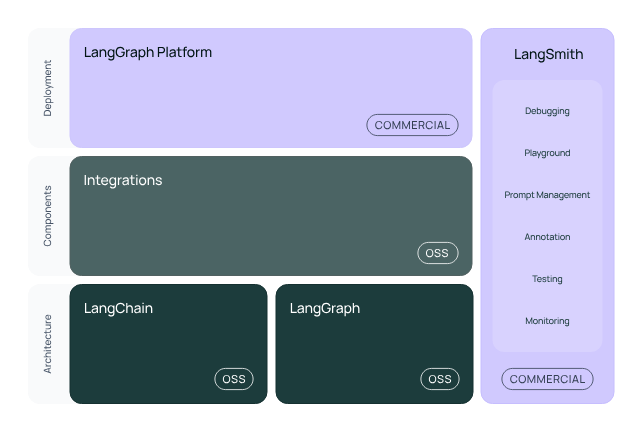

# kk_langchain_base

## langchain和langgraph基础应用讲解

### LangChain

LangChain 是一个开源框架，旨在帮助开发者使用大型语言模型（LLMs）和聊天模型构建端到端的应用程序。它提供了一套工具、组件和接口，以简化创建由这些模型支持的应用程序的过程。LangChain 的核心概念包括组件（Components）、链（Chains）、模型输入/输出（Model I/O）、数据连接（Data Connection）、内存（Memory）和代理（Agents）等。


以下是LangChain的一些关键特性和组件的详细解释：

1. **组件（Components）**：
   - **模型输入/输出（Model I/O）**：负责管理与语言模型的交互，包括输入（提示，Prompts）和格式化输出（输出解析器，Output Parsers）。
   - **数据连接（Data Connection）**：管理向量数据存储、内容数据获取和转换，以及向量数据查询。
   - **内存（Memory）**：用于存储和获取对话历史记录的功能模块。
   - **链（Chains）**：串联Memory、Model I/O和Data Connection，以实现串行化的连续对话和推理流程。
   - **代理（Agents）**：基于链进一步串联工具，将语言模型的能力和本地、云服务能力结合。
   - **回调（Callbacks）**：提供了一个回调系统，可连接到请求的各个阶段，便于进行日志记录、追踪等数据导流。

2. **模型输入/输出（Model I/O）**：
   - **LLMs**：与大型语言模型进行接口交互，如OpenAI、Cohere等。
   - **Chat Models**：聊天模型是语言模型的变体，它们以聊天信息列表为输入和输出，提供更结构化的消息。

3. **数据连接（Data Connection）**：
   - **向量数据存储（Vector Stores）**：用于构建私域知识库。
   - **内容数据获取（Document Loaders）**：获取内容数据。
   - **转换（Transformers）**：处理数据转换。
   - **向量数据查询（Retrievers）**：查询向量数据。

4. **内存（Memory）**：
   - 用于存储对话历史记录，以便在连续对话中保持上下文。

5. **链（Chains）**：
   - 是组合在一起以完成特定任务的一系列组件。

6. **代理（Agents）**：
   - 基于链的工具，结合了语言模型的能力和本地、云服务。

7. **回调（Callbacks）**：
   - 提供了一个系统，可以在请求的不同阶段进行日志记录、追踪等。

LangChain 的使用场景包括但不限于文档分析和摘要、聊天机器人、代码分析、工作流自动化、自定义搜索等。它允许开发者将语言模型与外部计算和数据源相结合，从而创建出能够理解和生成自然语言的应用程序。

要开始使用LangChain，开发者需要导入必要的组件和工具，组合这些组件来创建一个可以理解、处理和响应用户输入的应用程序。LangChain 提供了多种组件，例如个人助理、文档问答、聊天机器人、查询表格数据、与API交互等，以支持特定的用例。

LangChain 的官方文档提供了详细的指南和教程，帮助开发者了解如何设置和使用这个框架。开发者可以通过这些资源来学习如何构建和部署基于LangChain的应用程序。

### LangChain可以构建哪些应用

```lua
+----------------+      +-----------------------+      +------------------+
| 用户输入       | ---> | 输入处理模块 (处理文本) | ---> | LLM (大语言模型)  |
+----------------+      +-----------------------+      +------------------+
                                       |
                                       v
                            +--------------------------+
                            | 外部工具/API/数据库调用  |
                            +--------------------------+
                                       |
                                       v
                           +--------------------------+
                           | 输出生成 (格式化响应)   |
                           +--------------------------+
                                       |
                                       v
                                +----------------------+
                                | 用户反馈/调整         |
                                +----------------------+

```

LangChain 作为一个强大的框架，旨在帮助开发者利用大型语言模型（LLMs）构建各种端到端的应用程序。以下是一些可以使用 LangChain 开发的应用类型：

1. **聊天机器人（Chatbots）**：
   - 创建能够与用户进行自然对话的聊天机器人，用于客户服务、娱乐、教育或其他交互式场景。

2. **个人助理（Personal Assistants）**：
   - 开发智能个人助理，帮助用户管理日程、回答问题、执行任务等。

3. **文档分析和摘要（Document Analysis and Summarization）**：
   - 自动分析和总结大量文本数据，提取关键信息，为用户节省阅读时间。

4. **内容创作（Content Creation）**：
   - 利用语言模型生成文章、故事、诗歌、广告文案等创意内容。

5. **代码分析和生成（Code Analysis and Generation）**：
   - 帮助开发者自动生成代码片段，或者提供代码审查和优化建议。

6. **工作流自动化（Workflow Automation）**：
   - 通过自动化处理日常任务和工作流程，提高工作效率。

7. **自定义搜索引擎（Custom Search Engines）**：
   - 结合语言模型的能力，创建能够理解自然语言查询的搜索引擎。

8. **教育和学习辅助（Educational and Learning Aids）**：
   - 开发教育工具，如智能问答系统、学习辅导机器人等，以辅助学习和教学。

9. **数据分析和报告（Data Analysis and Reporting）**：
   - 使用语言模型处理和分析数据，生成易于理解的报告和摘要。

10. **语言翻译（Language Translation）**：
    - 利用语言模型进行实时翻译，支持多语言交流。

11. **情感分析（Sentiment Analysis）**：
    - 分析文本中的情感倾向，用于市场研究、社交媒体监控等。

12. **知识库和问答系统（Knowledge Bases and Q&A Systems）**：
    - 创建能够回答特定领域问题的智能问答系统。

LangChain 的灵活性和模块化设计使得开发者可以根据特定需求定制和扩展应用程序。通过将语言模型与外部数据源和APIs结合，LangChain 能够支持广泛的应用场景，从而创造出更加智能和用户友好的软件解决方案。


### langchain调用本地开源大模型

1. **类属性定义**:
   - `max_token`: 定义了模型可以处理的最大令牌数。
   - `do_sample`: 指定是否在生成文本时采用采样策略。
   - `temperature`: 控制生成文本的随机性，较高的值会产生更多随机性。
   - `top_p`: 一种替代`temperature`的采样策略，这里设置为0.0，意味着不使用。
   - `tokenizer`: 分词器，用于将文本转换为模型可以理解的令牌。
   - `model`: 存储加载的模型对象。
   - `history`: 存储对话历史。
2. **构造函数**:
   - `__init__`: 构造函数初始化了父类的属性。
3. **属性方法**:
   - `_llm_type`: 返回模型的类型，即`ChatGLM3`。
4. **加载模型的方法**:
   - `load_model`: 此方法用于加载模型和分词器。它首先尝试从指定的路径加载分词器，然后加载模型，并将模型设置为评估模式。这里的模型和分词器是从Hugging Face的`transformers`库中加载的。
5. **调用方法**:
   - `_call`: 一个内部方法，用于调用模型。它被设计为可以被子类覆盖。
   - `invoke`: 这个方法使用模型进行聊天。它接受一个提示和一个历史记录，并返回模型的回复和更新后的历史记录。这里使用了模型的方法`chat`来生成回复，并设置了采样、最大长度和温度等参数。
6. **流式方法**:
   - `stream`: 这个方法允许模型逐步返回回复，而不是一次性返回所有内容。这对于长回复或者需要实时显示回复的场景很有用。它通过模型的方法`stream_chat`实现，并逐块返回回复。

### 本地部署开源大模型

#### LM Studio

官网链接：https://lmstudio.ai/

LM Studio 是一款桌面应用程序，专门用于本地部署和运行大型语言模型（LLMs）。这个应用的核心优势在于它极大地降低了运行这些复杂模型的技术门槛，让即使是没有编程基础的普通用户也能够轻松地在本地运行这些模型。
主要特点包括：
1. **模型选择与下载**：LM Studio 提供了一个用户友好的界面，用户可以直接从中选择和下载多种大型语言模型。这些模型主要托管在 HuggingFace 网站上，包括一些热门的开源模型，例如 Mistral 7B、Codex、Blender Bot、GPT-Neo 等。
2. **简单直观的操作流程**：用户只需选择喜欢的模型，点击下载，等待下载完成后，通过 LM Studio 的对话界面加载本地模型，就可以开始与 AI 进行对话。
3. **API 转换功能**：LM Studio 还内置了将本地模型快速封装成与 OpenAI 接口兼容的 API 功能。这意味着用户可以将基于 OpenAI 开发的应用程序直接指向本地模型，实现相同的功能，并且完全免费。
4. **易用性和兼容性**：LM Studio 的设计考虑到了易用性和兼容性，使得用户可以轻松地在本地与各种高水平的 AI 模型进行交互。
5. **本地化运行**：该应用支持在本地运行大语言模型，避免了将数据发送到远程服务器的需要，这对于注重数据隐私和安全的用户来说是一个重要的优势。
总的来说，LM Studio 为普通用户提供了便捷的途径来探索和使用大型语言模型，无需复杂的环境配置或编程知识，即可在本地与高级 AI 模型进行交互。

#### vLLM
官网链接：https://docs.vllm.ai/en/latest/

vLLM 是由加州大学伯克利分校的 LMSYS 组织开发的一个开源大语言模型高速推理框架。这个框架的主要目的是显著提升语言模型服务在实时场景下的吞吐量和内存使用效率。vLLM 是一个快速且易于使用的库，专门用于大语言模型（LLM）的推理和服务，并且可以与 HuggingFace 无缝集成。
vLLM 框架的核心特点包括：
1. **高性能**：vLLM 在吞吐量方面表现出色，其性能比 Hugging Face Transformers（HF）高出 24 倍，比文本生成推理（TGI）高出 3.5 倍。
2. **创新技术**：vLLM 利用了全新的注意力算法「PagedAttention」，有效地管理注意力键和值，从而提高内存使用效率。
3. **易用性**：vLLM 的主框架由 Python 实现，便于用户进行断点调试。其系统设计工整规范，结构清晰，便于初学者理解和上手。
4. **关键组件**：vLLM 的核心模块包括 LLMEngine、Scheduler、BlockSpaceManager、Worker 和 CacheEngine。这些模块协同工作，实现了高效的推理和内存管理。
5. **显存优化**：vLLM 框架通过其创新的显存管理原理，优化了 GPU 和 CPU 内存的使用，从而提高了系统的性能和效率。
6. **应用广泛**：vLLM 可用于各种自然语言处理和机器学习任务，如文本生成、机器翻译等，为研究人员和开发者提供了一个强大的工具。
综上所述，vLLM 是一个高效、易用且具有创新技术的开源大语言模型推理框架，适用于广泛的自然语言处理和机器学习应用。

#### API for Open LLMs
GitHub地址：https://github.com/xusenlinzy/api-for-open-llm

API for Open LLMs 是一个强大的开源大模型统一后端接口，它提供与 OpenAI 相似的响应。这个接口支持多种开源大模型，如 ChatGLM、Chinese-LLaMA-Alpaca、Phoenix、MOSS 等。它允许用户通过简单的 API 调用来使用这些模型，从而提供了一种便捷的方式来运行和部署大型语言模型。
API for Open LLMs 的主要特点包括：
1. **模型支持**：支持多种流行的开源大模型，用户可以根据需要选择不同的模型。
2. **易用性**：提供简单易用的接口，用户可以通过调用这些接口来使用模型的功能，无需关心底层的实现细节。
3. **高效稳定**：采用了先进的深度学习技术，具有高效稳定的运行性能，可以快速处理大量的语言任务。
4. **功能丰富**：提供包括文本生成、问答、翻译等多种语言处理功能，满足不同场景下的需求。
5. **可扩展性**：具有良好的可扩展性，用户可以根据自己的需求对模型进行微调或重新训练，以适应特定的应用场景。
API for Open LLMs 的使用方法非常简单。用户首先需要注册并登录官网获取 API 密钥，然后通过调用相应的 API 接口来使用所需的功能。例如，进行文本翻译时，用户只需调用翻译功能的 API 接口，传递需要翻译的文本作为输入参数，即可获取翻译后的结果。
此外，API for Open LLMs 还支持通过 Docker 启动，用户可以构建 Docker 镜像并启动容器来运行服务。它还提供了本地启动的选项，用户可以在本地安装必要的依赖并运行后端服务。
总的来说，API for Open LLMs 是一个功能强大、高效稳定且易于使用的开源大模型接口，适用于各种自然语言处理任务。

#@ 大模型agent

大模型Agent通常指的是在人工智能领域，使用大规模神经网络模型来构建的智能体(Agent)。这种智能体能够处理和解决复杂的问题，比如自然语言处理、图像识别、游戏对战等。

大模型通常需要大量的数据来训练，这样才能学习到丰富的模式和信息。同时，大模型的训练和部署也需要较高的计算资源。近年来，随着计算能力的提升和数据的积累，大模型在人工智能领域取得了显著的进展，如OpenAI的GPT系列模型、Google的BERT模型等。

大模型Agent在很多领域都有广泛的应用，包括但不限于：
1. **自然语言处理**：如文本生成、机器翻译、情感分析等。
2. **图像和视频处理**：如图像识别、视频生成等。
3. **推荐系统**：如电商推荐、视频推荐等。
4. **游戏和娱乐**：如游戏对战、音乐生成等。
大模型Agent是当前人工智能研究和应用的热点之一，也是未来智能系统发展的重要方向。

### 如何应用大模型智能体

在自己的创作中应用大模型Agent，你可以遵循以下步骤：
1. **确定需求**：
   - 首先，明确你想要通过大模型Agent实现的功能。例如，你可能需要一个能够生成文本的模型来帮助创作故事，或者需要一个能够理解自然语言的模型来创建聊天机器人。
2. **选择合适的模型**：
   - 根据你的需求，选择一个合适的大模型。有许多开源模型可供选择，如GPT-3、BERT、T5等，也有一些商业模型和API服务，如OpenAI的GPT-3 API、Google Cloud的AI服务平台等。
3. **获取数据和资源**：
   - 准备训练数据（如果需要训练自己的模型），同时确保你有足够的计算资源来运行模型。如果使用现成的API服务，则不需要担心计算资源问题。
4. **集成到创作中**：
   - 将大模型Agent集成到你的创作流程中。例如，如果你是一名作家，你可以使用文本生成模型来帮助你构思故事情节或生成对话。如果你是一名游戏开发者，你可以使用模型来创造更自然的NPC对话或生成游戏内容。
5. **测试和迭代**：
   - 在创作过程中不断测试模型的效果，并根据反馈进行调整。这可能包括调整模型的参数、提供更多的训练数据或改进输入输出的处理方式。
6. **遵守法律和伦理准则**：
   - 在使用大模型Agent时，确保遵守相关的法律法规和伦理准则。例如，如果模型生成的内容涉及个人信息，需要确保遵守隐私保护法规。
7. **考虑用户体验**：
   - 考虑最终用户的体验，确保集成模型后的创作能够为用户提供价值，并且易于使用和理解。
8. **持续学习和适应**：
   - 人工智能领域不断发展，新的模型和技术层出不穷。作为创作者，你需要持续学习新的工具和技术，以便更好地利用它们来丰富你的创作。
通过以上步骤，你可以在自己的创作中有效地应用大模型Agent，无论是艺术创作、写作、游戏开发还是其他领域。


## Concepts概念

智能体的核心思想是使用语言模型来选择要执行的一系列操作。在链中，一系列操作是硬编码的（在代码中）。在代理中，语言模型用作推理引擎，以确定要采取哪些操作以及以何种顺序执行。

这里有几个关键组件：


### AgentAction 代理操作

这是一个数据类，表示代理应执行的操作。它有一个 tool 属性（应调用的工具的名称）和一个 tool_input 属性（该工具的输入）

###    AgentFinish （代理完成）
这表示代理准备返回给用户时的最终结果。它包含一个 return_values 键值映射，其中包含最终的代理输出。通常，这包含一个 output 密钥，其中包含一个字符串，该字符串是代理的响应。

### Intermediate Steps 中间步骤
这些表示以前的代理操作和此当前代理运行的相应输出。这些对于传递到将来的迭代非常重要，这样代理就知道它已经完成了哪些工作。这被键入为 List[Tuple[AgentAction, Any]] .请注意，观察目前保留为类型 Any ，以最大限度地灵活。在实践中，这通常是一个字符串。

### Agent 代理

这是负责决定下一步采取什么步骤的链。这通常由语言模型、提示和输出解析器提供支持。

不同的智能体具有不同的推理提示风格、不同的输入编码方式以及不同的输出解析方式。有关内置代理的完整列表，请参阅代理类型。如果您需要进一步控制，您还可以轻松构建自定义代理。


### Agent Inputs 代理输入

代理的输入是键值映射。只有一个必需的键： intermediate_steps ，如 Intermediate Steps 上所述。

通常，PromptTemplate 负责将这些对转换为最好传递到 LLM.

### Agent Outputs 代理输出

输出是要执行的下一个操作或要发送给用户的最终响应（ AgentAction s 或 AgentFinish ）。具体来说，这可以键入为 Union[AgentAction, List[AgentAction], AgentFinish] 。

输出解析器负责获取原始LLM输出并将其转换为这三种类型之一。

### AgentExecutor 代理执行器

代理执行程序是代理的运行时。这实际上是调用代理，执行它选择的操作，将操作输出传递回代理，然后重复。在伪代码中，这大致如下所示：

```
next_action = agent.get_action(...)
while next_action != AgentFinish:
    observation = run(next_action)
    next_action = agent.get_action(..., next_action, observation)
return next_action
```

然这看起来很简单，但此运行时会为你处理一些复杂性，包括：

1. 处理代理选择不存在的工具的情况
2. 处理工具错误的情况
3. 处理代理生成无法解析为工具调用的输出的情况
4. 对 stdout 和/或 LangSmith 的所有级别（代理决策、工具调用）进行日志记录和可观察性。


### Tools 工具

工具是代理可以调用的功能。 Tool 抽象由两个组件组成：

1. 工具的输入方案。这说明了LLM调用该工具所需的参数。没有这个，它将不知道正确的输入是什么。这些参数应合理地命名和描述。
2. 要运行的函数。这通常只是一个被调用的 Python 函数。

如果不考虑两者，您将无法构建有效的代理。如果您不授予代理访问一组正确工具的权限，它将永远无法实现您为其提供的目标。如果你没有很好地描述这些工具，代理将不知道如何正确使用它们。

LangChain提供了广泛的内置工具，但也可以轻松定义自己的工具（包括自定义描述）。有关内置工具的完整列表，请参阅工具集成部分

对于许多常见任务，代理将需要一组相关工具。为此，LangChain提供了工具包的概念 - 完成特定目标所需的大约3-5个工具组。例如，GitHub 工具包具有用于搜索 GitHub 问题的工具、用于读取文件的工具、用于评论的工具等。


### Agent Types 代理类型

这会从几个维度对所有可用的代理进行分类。

#### Intended Model Type 预期型号类型

此代理是用于聊天模型（接收消息，输出消息）还是LLMs（接收字符串，输出字符串）。这主要影响的是所使用的提示策略。您可以使用具有与预期模型类型不同的代理，但它可能不会产生相同质量的结果。

#### Supports Chat History 支持聊天记录

这些代理类型是否支持聊天记录。如果是这样，这意味着它可以用作聊天机器人。如果没有，则意味着它更适合单个任务。支持聊天记录通常需要更好的模型，因此针对较差模型的早期代理类型可能不支持它。

#### Supports Multi-Input Tools支持多输入工具
这些代理类型是否支持具有多个输入的工具。如果一个工具只需要一个输入，通常LLM更容易知道如何调用它。因此，针对较差模型的几种早期代理类型可能不支持它们。

#### Supports Parallel Function Calling支持并行函数调用
同时LLM调用多个工具可以大大加快座席的速度，无论是否有任务可以通过这样做来辅助。但是，这样做更具挑战性LLMs，因此某些代理类型不支持此功能。

#### Required Model Params 必需的模型参数
此代理是否要求模型支持任何其他参数。某些代理类型利用了 OpenAI 函数调用等需要其他模型参数的功能。如果不需要，则意味着一切都是通过提示完成的
